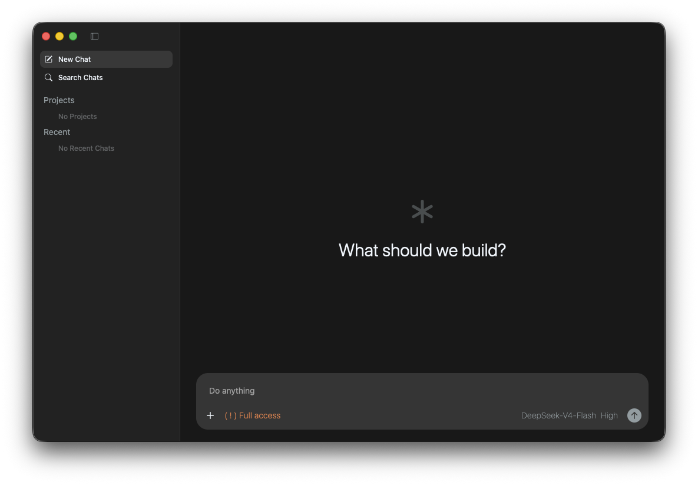
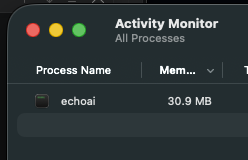

# Squawk

## Performance Obsessed LLM Harness

<i>Look familiar?</i>

 

This is an LLM harness that uses a miniscule **40mb of ram** and runs at the framerate of your monitor (e.g. 144fps).

## Current Status and Open Source.

I intend to open source this project and open it up to contributions but am not ready for that just yet as it's just a little side project / experiment.

For now I am just going to ship binaries as releases. 

If there is interest in this project, please star it 🙏 as that gives me signal that the work is valuable and
that'll give me motivation to complete and share it.

Right now I am experimenting with making the UI pretty. I will use an existing harness for agentic capabilities (probably Goose or Codex CLI). 

Eventually I intend to port the DeepSeek harness to Rust to use as the harness backend.

### Platform Support and Installation

This is distributed as a portable binary under GitHub releases. Just download and run. 

It supports;

- Linux (TODO `AppImage`)
- MacOS (TODO `Squawk.app`)
- Windows

## Introducing Squawk

Running Claude or Codex desktop, the applications are sluggish and heavy. Codex uses _1 gigabyte_ of ram for just the UI. This is due to the fact that they ship a full browser along with their application code and their application code is written in JavaScript. 

This technical choice has historically been practical for cross-platform development because developing separate dedicated native applications using native technologies was an expensive process.

But we are in the age of AI and, by Grayskull, there's no excuse to ship low quality applications.

## But, How?

Squawk uses a tiny game engine to render UI widgets. This allows it to leverage APIs like Metal, Vulkan and DirectX while also being absolutely tiny.

Naturally, game engines are crazy optimized, so the UI runs butter smooth and uses pretty much no resources.

Squawk leverages the work done by the [Zed editor](https://zed.dev/), utilizing their [gpui-kit](https://crates.io/crates/gpui-kit). It's super easy to use, basically HTML and CSS.

## But, Why?

Have you seen the price of ram? I had to sell my Pokemon card collection just to get an extra 4gb of ram in my MacBook Pro... and it's still not enough.

I sort of view this as something of a case study on the fact that we can, in fact, develop high quality cross-platform applications today and it's actually not that hard.

Also, these days, software has never been worse to use. Encarpification, call it what you will, but it's just really fun to make something super high quality.

 
 
 
 

<!-- ## Support The Development -->

<h1>Support The Project 🙏</h1>
<a href="https://wise.com/pay/me/davidsama1">

<i>Donate with Wise</i>

</a>

